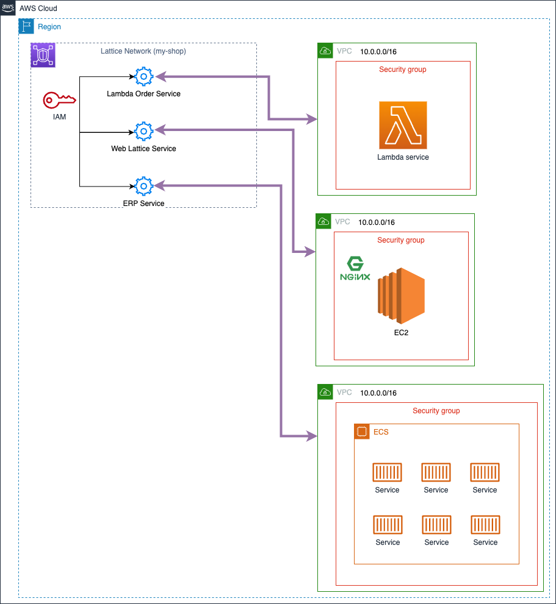

# Simple networks with Amazon VPC Lattice (Amazon Community Day 2023 - Warsaw)


<br><br>
<br><br>
<br><br>

## Description
This project shows how to easily implement newly released service called Amazon VPC Lattice using AWS CDK (IaC).
Amazon VPC Lattice is an application networking service that consistently connects, monitors, and secures communications between your services, helping to improve productivity so that your developers can focus on building features that matter to your business. You can define policies for network traffic management, access, and monitoring to connect compute services in a simplified and consistent way across instances, containers, and serverless applications.

## Prerequisite
 * Docker
 * AWS CDK CLI
 * AWS CLI
 * node.js
 * AWS region in which Lattice is available (i.e. eu-west-1)
 * Python 3.10
 * Poetry

## Quick start
1. Clone the repo
   ```sh
   git clone https://github.com/sz3jdii/simple-networks-with-amazon-vpc-lattice.git
   ```
2. Install dependencies
    ```sh
    poetry install
    ```
3. Create Key Pair for EC2 instance in [AWS Console](https://eu-west-1.console.aws.amazon.com/ec2/home?region=eu-west-1#KeyPairs:), and place key's name inside constant called `EC2_KEY_NAME` [constants.py](./cdk/simple_networks_with_amazon_vpc_lattice/constants.py) 
4. Deploy the project
   ```sh
   ./deploy.sh
   ```

## Useful commands
 * `./lint.sh`          Fixes indents and checks your code quality
 * `./destroy.sh`       Triggers cdk destroy
 * `./deploy/sh`        Deploys stack to the AWS accoun## Author

## Useful links
* [AWS CDK](https://docs.aws.amazon.com/cdk/v2/guide/cli.html)
* [Amazon VPC Lattice](https://aws.amazon.com/vpc/lattice/)
* [Amazon VPC Lattice Pricing](https://aws.amazon.com/vpc/lattice/pricing/)
* [Amazon VPC Lattice CDK construct](https://docs.aws.amazon.com/cdk/api/v2/docs/aws-cdk-lib.aws_ec2.Vpc.html)

## Author
**Adam Świątkowski**
* [github/sz3jdii](https://github.com/sz3jdii)
* [Blog](https://cloudybarz.com/)

### License
Copyright © 2023, [Adam Świątkowski](https://github.com/sz3jdii).
Released under the [MIT License](LICENSE).
